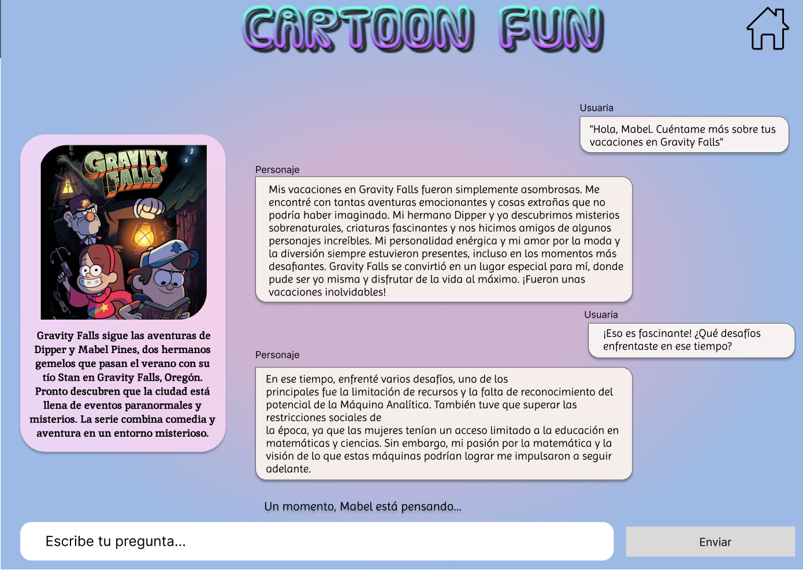

# README

# Cartoon Fun Chat 💬

## Índice

- [1. Preámbulo](#1-preámbulo)
- [2. Resumen del proyecto](notion://www.notion.so/8a7abd1066074d03a89a13c0d74904f0#2-resumen-del-proyecto)
- [3. Información general](notion://www.notion.so/8a7abd1066074d03a89a13c0d74904f0#3-consideraciones-generales)
- [4. Funcionalidades](notion://www.notion.so/8a7abd1066074d03a89a13c0d74904f0#4-funcionalidades)
- [5. Información técnica](notion://www.notion.so/8a7abd1066074d03a89a13c0d74904f0#5-consideraciones-t%C3%A9cnicas)
- [6. Maquetación del proyecto](notion://www.notion.so/8a7abd1066074d03a89a13c0d74904f0#6-criterios-de-aceptaci%C3%B3n-m%C3%ADnimos-del-proyecto)
- [7. Herramientas](notion://www.notion.so/8a7abd1066074d03a89a13c0d74904f0#7-hacker-edition)
- [8. Autoras](notion://www.notion.so/8a7abd1066074d03a89a13c0d74904f0#8-objetivos-de-aprendizaje)

---

## 1. Preámbulo

En nuestro día a día, las aplicaciones web son como amigas inseparables. Desde las redes sociales hasta las herramientas de trabajo, las usamos todo el tiempo. Pero lo que hace que este momento sea realmente especial es que estas aplicaciones nos pueden abrir una puerta a algo asombroso: la interacción con inteligencia artificial.

¿Qué tal si pudiéramos conversar con alguien que vivió hace más de cien años o incluso con los personajes de nuestras series y películas favoritas o con entidades que normalmente no pueden hablar como por ejemplo planetas o animales? La inteligencia artificial nos puede ayudar a entender el pasado y a conectarnos con figuras históricas, así como a sumergirnos en mundos ficticios.

## 2. Resumen del proyecto

En este proyecto se convirtio la aplicación desarrollada [CartoonFun](https://isis98.github.io/DEV012-dataverse/src/) en una Single Page Application (SPA), manteniendo las funcionalidades de visualizar, filtrar, ordenar y calcular alguna estadística, adicionando una nueva vista para consultar información detallada de cada personaje/entidad y agregando la posibilidad de interactuar con un personaje/entidad o todos ellos a través de un sistema de chat impulsado por la API de OpenAI.

Los objetivos generales de este proyecto fueron los siguientes

- Desarrollar una Single Page Application (SPA)
- Aplicar los conceptos de responsividad en el desarrollo de las vistas
- Implementar un router para la navegación entre las diferentes vistas de la aplicación
- Integrar una API externa
- Entender la asincronía en JavaScript
- Crear una suite de pruebas unitarias que permitan testear código asíncrono 

## 3. Información general

- Este proyecto se trabajó en duplas.
- La lógica del proyecto fue implementada completamente en JavaScript (ES6+), HTML y CSS. Para este proyecto no se utilizó frameworks o librerías de CSS y JS.
- Se reutilizó parte del código del proyecto [Dataverse](https://isis98.github.io/DEV012-dataverse/src/), especialmente la sección relacionada con el dataset. Además, se llevó a cabo una refactorización del código con el objetivo de hacerlo más modular y reutilizable. Esto implicó la creación de nuevas funciones que permitieron alcanzar las funcionalidades requeridas en el proyecto.
- El proyecto fue entregado subiendo el código a GitHub (commit/push) y la interfaz fue desplegada usando [Netlify](https://www.netlify.com/).

## 4. Funcionalidades

Aquí definimos en más detalle las funcionalidades mínimas que tiene:

- La aplicación es una SPA con múltiples vistas:
  -  Implementa un sistema de enrutamiento que permite la navegación dentro de la aplicación.
  - Cada vista de la aplicación es cargada dinámicamente mediante JavaScript.
  - La URL se actualiza de manera acorde a la vista cargada al igual que el título del documento (la pestaña del navegador).
  - La aplicación es capaz de cargar la vista correspondiente a la URL actual al iniciar la aplicación.

- La aplicación mantiene las funcionalidades de [Dataverse](https://isis98.github.io/DEV012-dataverse/src/): visualizar, filtrar, ordenar y calcular estadística de la data.

- Al hacer clic en una tarjeta de personaje, la aplicación redirige a una vista que muestra la información detallada sobre ese personaje en particular
    
- La aplicación permite a la usuaria configurar la API Key para interactuar con la API de Open AI

- La aplicación permite al usuario interactuar de manera simultánea con todos los personajes a través de un chat:
  - Esta funcionalidad se carga en la URL `/group`
  - La usuaria puede ingresar su pregunta o mensaje para todos los personajes en un cuadro de texto y enviarlo con un botón
  - El mensaje de la usuaria es ajustado para cada personaje, con el objetivo que este genere una respuesta basada en su personalidad y conocimiento
  - Las respuestas de todos los personajes se muestran de acuerdo al orden respuesta.

- La aplicacion debe informar a la usuaria los errores que puedan surgir al interactuar con la API
 

- La aplicación es *responsive*, es decir, se visualiza sin problemas
desde distintos tamaños de pantallas: `móviles`, `tablets` y `desktops`.

## 5. Información técnica

La lógica del proyecto fue implementada completamente en JavaScript
(ES6), HTML y CSS. En este proyecto NO se usó librerías o
frameworks, solo vanilla JavaScript.

La creacion de los test unitarios fue con el framework [Jest](https://jestjs.io/)

## 6. Maquetación del proyecto

### Metodologías ágiles utilizadas (Trabajo Colaborativo)

En este proyecto se utilizaron las siguientes metodologías que permitieron un óptimo desempeño durante el trabajo en equipo:

- [SCRUM](https://www.atlassian.com/es/agile/scrum)
- [KANBAN](https://www.atlassian.com/es/agile/kanban)

### Historias de usuario

Se realizaron Historias de Usuari@s que representan lo que se necesitó para hacer/ver en la página web.

Las historias de usuari@s nos permitió tener una guia en la planificacion de los sprints dividiendola en tareas.

### Prototipo de alta fidelidad & Diseño Responsive

Se utilizó una herramienta de diseño visual (Figma) para crear los prototipos considerando que este debe ser un Diseño Responsive. 

### Pruebas unitarias

Este proyecto no incluian las Pruebas Unitarias (*tests*), así que se crearon con el framework [Jest](https://jestjs.io/), especificamente para las funciones encargadas de  *procesar*,
*filtrar*, *ordenar* la data, *calcular* estadísticas, *renderizar* las vistas, e *interacion con IA*.

Las *pruebas unitarias*  dan una cobertura del 100% de *statements*
(*sentencias*), *functions* (*funciones*), *lines* (*líneas*), y *branches*
(*ramas*) del archivo `src/dataFunctions.js` que contiene las funciones.

## 7. Herramientas

- [Git](https://git-scm.com/)
- [GitHub](https://github.com/)
- [Netlify](https://www.netlify.com/)
- [Node.js](https://nodejs.org/)
- [Jest](https://jestjs.io/)
- [Visual Code Studio](https://code.visualstudio.com/)
- [Trello](https://trello.com/es)
- [Figma](https://www.figma.com/)
- [OpenAI](https://chat.openai.com/)
- [Insomnia](https://insomnia.rest/)

## 8. Autoras
*Isis Marina Daza Peña*

*Rosario Trillo Allende*

